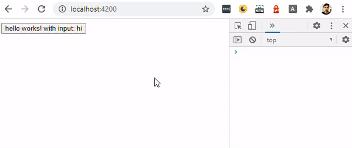

<h1 align="center">Welcome to chrome-ext-ng-props 👋</h1>
<p>
  
  <a href="https://github.com/shhdharmen/chrome-ext-ng-props" target="_blank">
    
  </a>
  <a href="#" target="_blank">
    
  </a>
  <a href="https://twitter.com/shhdharmen" target="_blank">
    
  </a>
  <a href="http://commitizen.github.io/cz-cli/" target="_blank">
    
  </a>
</p>

> A chrome extension to inspect and change Angular component properties.



## Development

```bash
git clone https://github.com/shhdharmen/chrome-ext-ng-props.git
cd chrome-ext-ng-props
npm i
npm start
```

1. Navigate to _chrome://extensions_ in your browser. You can also access this page by clicking on the Chrome menu on the top right side of the Omnibox, hovering over More Tools and selecting Extensions.
2. Check the box next to Developer Mode.
3. Click Load Unpacked Extension and select the `dist` directory.

## Author

👤 **Dharmen Shah**

- Website: [shhdharmen.github.io](https://shhdharmen.github.io)
- Twitter: [@shhdharmen](https://twitter.com/shhdharmen)
- Github: [@shhdharmen](https://github.com/shhdharmen)
- LinkedIn: [@shhdharmen](https://linkedin.com/in/shhdharmen)

## 🤝 Contributing

Contributions, issues and feature requests are welcome!<br />Feel free to check [issues page](https://github.com/shhdharmen/chrome-ext-ng-props/issues).

## Show your support

Give a ⭐️ if this project helped you!
