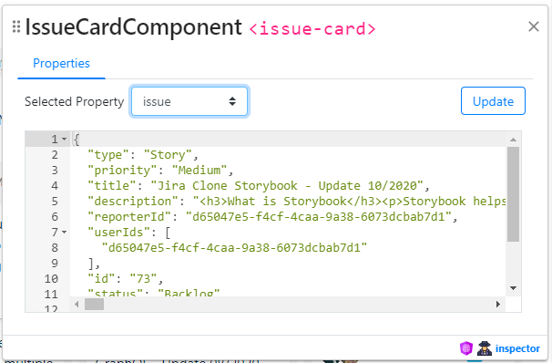
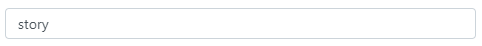
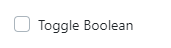
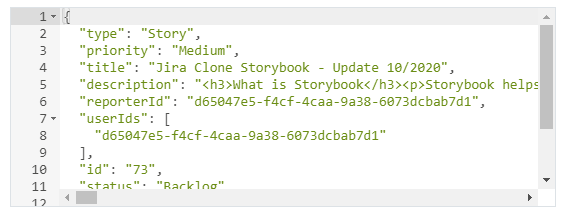
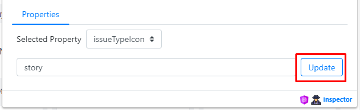

<!-- markdownlint-disable -->
<p align="center">
 
</p>

<br />

[]()
[]()
[]()
[](https://github.com/prettier/prettier)
[](#contributors-)
[](https://github.com/ngneat/)
[]()

> An angular library that lets you inspect and change Angular 9+ component properties

<p align="center">
  
</p>


<!-- markdownlint-restore -->

## Features <!-- omit in toc -->

- ✅ Inspect Angular 9+ components on the fly
- ✅ Change component properties without touching the code
- ✅ Simulate Angular events
- ✅ See the results in realtime

## Table of Contents <!-- omit in toc -->

- [Installation](#installation)
  - [Angular CLI](#angular-cli)
- [Usage](#usage)
- [Options](#options)
- [Contributors ✨](#contributors-)

## Installation

This library supports Angular 9+ projects and should only be installed using Angular CLI.

### Angular CLI

```bash
ng add @ngneat/inspector
```

Above command will do following for you:

1. Add and install following dev dependencies:
   1. [@ngneat/inspector](https://www.npmjs.com/package/@ngneat/inspector)
   2. [ace-builds](https://www.npmjs.com/package/ace-builds)
   3. [tinykeys](https://www.npmjs.com/package/tinykeys)
2. Import `environments` from `../environments/environment.ts` in projects root module. *This can be skipped with `--skipImport`.*
3. Import `InspectorModule` from `@ngneat/inspector` in your project's root module's `imports` section. *This can be skipped with `--skipImport`.*

> 👉 Please note: @ngneat/inspector is a debugging tool and it helps you to develop faster. So, it shouldn't be part of your production deployment. When you install it using `ng add @ngneat/inspector` it is already taken care for you, as it writes import statement like this: `imports: [environment.production ? [] : InspectorModule.forRoot()]`

## Usage

<!-- markdownlint-disable -->
1. Click on Inspector button 
2. Then hover over the component which you want to inspect, you will see purple colored outline on the currently hovered element<br>
3. Click on the element and inspector will expand with component's details like name, selector, properties (with inputs), and outputs (if any)<br>
4. You can change the property/outputs from select<br>
5. Data types: Below are the supported data types and how it will render in inspector:
   1. String - input[type=text]<br>
   2. Number - input[type=text]<br>
   3. Boolean - input[type=checkbox]<br>
   4. Object - ace-editor<br>
6. Properties - To update any property, after updating value, you will need to click on `Update` button to see the effect<br>
7. Outputs<br>
   1. To call the output, you will need to click on `Emit` button.
   2. By default, 1 argument with string type will be shown. You can change the type by change value from type select.
   3. You can also add/remove arguments by clicking on respective buttons
<!-- markdownlint-restore -->

## Options

When you ran `ng add @ngneat/inspector`, it added below statement in your imports array:

```typescript
imports: [environment.production ? [] : InspectorModule.forRoot()]
```

Now, you can pass below config options to change inspector behavior in the `.forRoot()` method, like: `InspectorModule.forRoot({ zIndex: 100000000 })`.

All the options are optional.:

<!-- markdownlint-disable -->

| Option                | Type                                                                                                                                                                                                                      | Description                                                                                                                                                                                                                                                              |
| --------------------- | ------------------------------------------------------------------------------------------------------------------------------------------------------------------------------------------------------------------------- | ------------------------------------------------------------------------------------------------------------------------------------------------------------------------------------------------------------------------------------------------------------------------ |
| enabled               | `boolean`                                                                                                                                                                                                                 | Enable or disable the inspector<br>*Default value: `true`*                                                                                                                                                                                                               |
| zIndex                | `number`                                                                                                                                                                                                                  | Gives the CSS `z-index` to inspector host element. Useful in-case it's not visible by default.<br>*Default value: `100000000`*                                                                                                                                           |
| outline               | `InspectorConfigOutline`<br>`{`<br>&nbsp;&nbsp;&nbsp;&nbsp;`color?: string;`<br>&nbsp;&nbsp;&nbsp;&nbsp;`width?: string;`<br>&nbsp;&nbsp;&nbsp;&nbsp;`style?: string;`<br>`}`                                             | Applies style to outline, when you're hovering over elements after starting inspector.<br>*Default value:<br>`{`<br>&nbsp;&nbsp;&nbsp;&nbsp;`color: '#ad1fe3',`<br>&nbsp;&nbsp;&nbsp;&nbsp;`width: '2px',`<br>&nbsp;&nbsp;&nbsp;&nbsp;`style: 'solid'`<br>`}`*           |
| position              | `InspectorConfigPosition`<br>`{`<br>&nbsp;&nbsp;&nbsp;&nbsp;`top?: string;`<br>&nbsp;&nbsp;&nbsp;&nbsp;`right?: string;`<br>&nbsp;&nbsp;&nbsp;&nbsp;`bottom?: string;`<br>&nbsp;&nbsp;&nbsp;&nbsp;`left?: string;`<br>`}` | Applies CSS Style position co-ordinates to inspector host element. Please note inspector host element has `position: fixed` for better usability.<br>*Default value:<br>`{`<br>&nbsp;&nbsp;&nbsp;&nbsp;`top: '20px',`<br>&nbsp;&nbsp;&nbsp;&nbsp;`right: '20px'`<br>`}`* |
| keyCombo              | `string`                                                                                                                                                                                                                  | Key combination pattern to start, stop and restart inspecting. Based on [tinykeys keybinding syntax](https://github.com/jamiebuilds/tinykeys#keybinding-syntax). You can disable this by setting `enableKeyCombo` to `false`.<br>*Default value: `Shift+I`*              |
| closeOnEsc            | `boolean`                                                                                                                                                                                                                 | Close/Stop inspector when escape key is pressed.<br>*Default value: `true`*                                                                                                                                                                                              |
| enableKeyCombo        | `boolean`                                                                                                                                                                                                                 | Enable keyboard shortcut to open inspector. You can change the keybindings using `keyCombo` options.<br>*Default value: `true`*                                                                                                                                          |
| hideNonSupportedProps | `boolean`                                                                                                                                                                                                                 | This hides non-supported types from selector. Only `string`, `number`, `boolean` and `object` are supported as of now.<br>*Default value: `true`*                                                                                                                        |
| filterProps           | `RegExp`                                                                                                                                                                                                                  | A regular expression to filter out properties.<br>*Default value: `/(^__)\w*/g`*                                                                                                                                                                                         |

<!-- markdownlint-restore -->

<!-- ## FAQ

## How to ...

Lorem ipsum dolor sit amet, consectetur adipisicing elit. Aliquid assumenda atque blanditiis cum delectus eligendi ips -->

## Contributors ✨

Thanks goes to these wonderful people ([emoji key](https://allcontributors.org/docs/en/emoji-key)):

<!-- ALL-CONTRIBUTORS-LIST:START - Do not remove or modify this section -->
<!-- prettier-ignore-start -->
<!-- markdownlint-disable -->
<table>
  <tr>
    <td align="center"><a href="https://github.com/shhdharmen"><br /><sub><b>Dharmen Shah</b></sub></a><br /><a href="https://github.com/@ngneat/inspector/commits?author=shhdharmen" title="Code">💻</a> <a href="#content-shhdharmen" title="Content">🖋</a> <a href="#ideas-shhdharmen" title="Ideas, Planning, & Feedback">🤔</a> <a href="#maintenance-shhdharmen" title="Maintenance">🚧</a></td>
    <td align="center"><a href="https://www.netbasal.com/"><br /><sub><b>Netanel Basal</b></sub></a><br /><a href="https://github.com/@ngneat/inspector/issues?q=author%3ANetanelBasal" title="Bug reports">🐛</a> <a href="#content-NetanelBasal" title="Content">🖋</a> <a href="https://github.com/@ngneat/inspector/commits?author=NetanelBasal" title="Documentation">📖</a> <a href="#ideas-NetanelBasal" title="Ideas, Planning, & Feedback">🤔</a> <a href="#mentoring-NetanelBasal" title="Mentoring">🧑‍🏫</a></td>
  </tr>
</table>

<!-- markdownlint-restore -->
<!-- prettier-ignore-end -->

<!-- ALL-CONTRIBUTORS-LIST:END -->

This project follows the [all-contributors](https://github.com/all-contributors/all-contributors) specification. Contributions of any kind welcome!

---

*Icons made by [Freepik](http://www.freepik.com/ "Freepik") from [www.flaticon.com](http://www.flaticon.com/ "Flaticon")*
